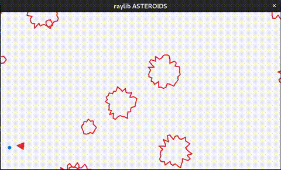

# Raylib Asteroids

Hobbyprojekt för att testa C och raylib, kul att skriva något helt procedurelt utan klasser o grejer.

För att bygga projektet kan man läsa [Quickstart README.md](QuickStartREADME.md), projektet är baserat på [raylib quickstart](https://github.com/raylib-extras/raylib-quickstart) 

Häger och vänsterpil för att rotera, upp och ner för att gasa, mellanslag för att skjuta.